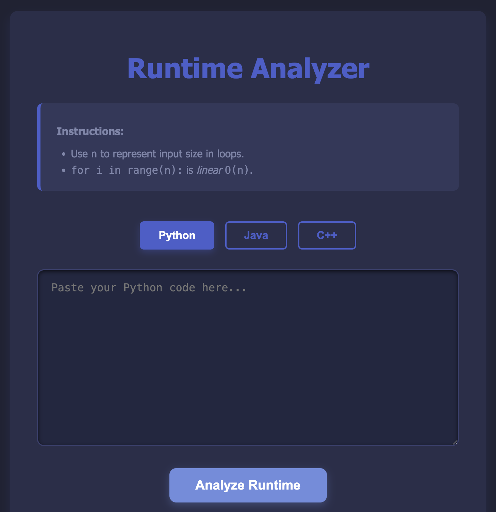

# Complexity Checker
### Webpage can be found [here](https://anejmeldeen.github.io/complexitychecker/)

Complexity Checker is a tool that analyzes snippets of code in Python, Java, and C++
Uses variable and code structure to estimate the runtime complexity of your algorithm.

<table style="border-collapse: collapse;">
  <tr>
    <td style="border: none; padding: 0;">
      
    </td>
  </tr>
</table>

## Features:
- Instant analysis of runtime
- Short explanation of code structure

## Technologies Used:
- HTML, CSS, Javascript
- NodeJS
