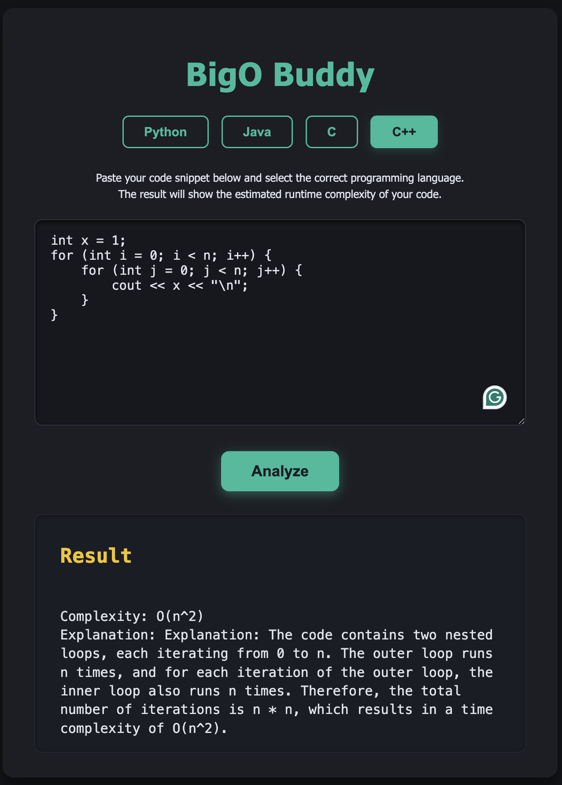

# BigO Buddy

BigO Buddy is a web application that analyzes your code snippets and estimates their runtime complexity (Big O notation) for several popular programming languages.

Try it live here: [https://anejmeldeen.github.io/BigO-Buddy/]

---

## How It Works

- **Frontend:**  
  Built with plain HTML, CSS, and JavaScript, the frontend provides a clean interface where users can paste their code and select the programming language.

- **Backend:**  
  A Python Flask API processes the submitted code and returns an estimated runtime complexity.  
  The backend handles CORS to allow cross-origin requests from the frontend.
  Uses the OpenAI API to analyze code to determine the algorithmic efficiency.

---

## Technologies Used

- **HTML5 & CSS3:** For structure and styling of the user interface  
- **JavaScript:** To manage interactivity and communicate with the backend API  
- **Python & Flask:** Lightweight backend framework serving API endpoints  
- **Flask-CORS:** Enables cross-origin resource sharing for frontend-backend communication  
- **Render.com:** Hosting platform for the backend API  
- **GitHub Pages:** Hosting platform for the frontend website

---

## Source Code

- Frontend source: [`./`](./)  
- Backend source: [`backend/`](./backend)

---
